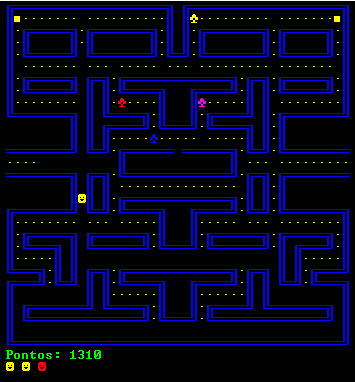

# pacman-c
Esse foi meu primeiro projeto de programação quando entrei no curso de Engenharia de computação, desenvolvido como trabalho para a disciplina de Laboratório de Programação I. Por esse motivo, o código precisa de muitas melhorias e refatoração (o que pretendo fazer algum dia).

    

**Só funciona no Windows :/**
